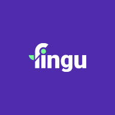
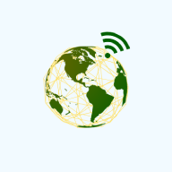
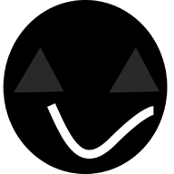
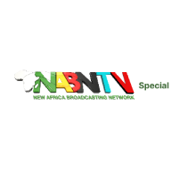
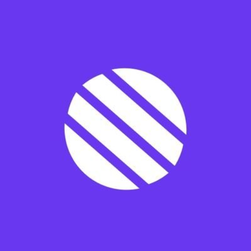
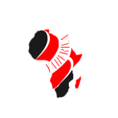

# ADEBAYO FAWAZ AJIBOLA

## Fullstack web developer

## ABOUT

Hi there,

I am Fawaz, a full-stack web developer with a passion for solving real-world problems by building business solutions using technologies like JavaScript, HTML, CSS and React. Although I am currently studying Information and Communication Science at the University of Ilorin, Nigeria, I have been working as a professional in this field since 2017.

In my 4 years of experience in web development and I have built knowledge in technical documentation, working in Agile environments, core system development, algorithms and data structures. I have a Diploma in Web Design from Global Techs and other certifications in Web development, JavaScript and Nodejs. I enjoy building user experience and interfaces, making sure that these interfaces are properly implemented with frontend languages and excellent backend servers in real-time. I am highly skilled in the following programming languages, technologies and tools:

- Programming languages

  - JavaScript
  - Typescript
  - Dart
  - Golang

- databases

  - Postgresql
  - MySQL
  - MongoDB

- Technologies

  - Node.js - Express - REST API - Nestjs
  - React.js - Next.js
  - Sass/scss
  - PWA
  - Vue - Nuxtjs

- Tools
  - Git and GitHub

My other areas of interest are mobile app development and Web 3. I am an excellent team player, communicator, and problem solver with a desire to always exceed expected results. I am willing, open, and ready to accept opportunities tailored to providing an ever progressive career experience and global exposure with both challenging and rewarding roles. When I am not interacting with codes, I enjoy playing games and listening to good music.

Do I sound like a good fit for your team?, Contact me here; fawaz.adebayo.ajibola@gmail.com

## PROJECTS

<table>
  <tr>
    <td rowspan="3">
      
    </td>
    <td><a href="https://fingu.io/">project link</a></td>
  </tr>
  <tr>
    <td>React, nextjs Typescript</td>
  </tr>
  <tr>
    <td>server side rendered website</td>
  </tr>
  <tr>
    <td colspan="2">
      We believe that investing in the stock market should be democratized, especially for young adults who think that it is reserved for a more mature and wealthier audience.
      We founded Fingu because we believe that everyone should have the chance to achieve financial freedom.
      created in colaboration with <a href="https://github.com/TGod-Ajayi" target="_blank">@TGod-Ajayi</a>
</td>

  </tr>
</table>

<table>
  <tr>
    <td rowspan="3">
      
    </td>
    <td><a href="https://drugstore.ng/">project link</a></td>
  </tr>
  <tr>
    <td>nuxjs</td>
  </tr>
  <tr>
    <td>server side rendered website</td>
  </tr>
  <tr>
    <td colspan="2">
      Drugstore is Nigeria’s online pharmacy where you can buy drugs, medical
      and hospital equipment from registered pharmacies in Nigeria with the
      option of picking it up at the pharmacy or door delivery. 
      Drugstore Nigeria enables easier and faster access to drugs. Pharmacies
      can reach more customers outside its locality, and reduce drug wastage due
      to expiry dates or low patronage. Patients can buy drugs confidently
      knowing that the pharmacy is registered and trustworthy.
    </td>
  </tr>
</table>

<table>
  <tr>
    <td rowspan="3">
      
    </td>
    <td><a href="https://techreach-makerspace.vercel.app/">project link</a></td>
  </tr>
  <tr>
    <td>Nexjs</td>
  </tr>
  <tr>
    <td>staic SPA website</td>
  </tr>
  <tr>
    <td colspan="2">
     Our team has experienced the world in a variety of ways. We've helped hundreds of businesses succeed online by delivering solutions to difficulties in both rural and urban areas throughout the world. Learn more about what we can offer you by booking a consultation with us today.
    </td>
  </tr>
</table>

<table>
  <tr>
    <td rowspan="3">
      
    </td>
    <td><a href="https://payo.vercel.app/">project link</a></td>
  </tr>
  <tr>
    <td>Nexjs, Mongodb</td>
  </tr>
  <tr>
    <td>server side rendered website + PWA</td>
  </tr>
  <tr>
    <td colspan="2">
      a simulation of a fintech app with all features login with "pherwerz" as
      username and "pass1234" as password. This app also has a push notification functions that allows users to get notified when a new transaction is created
    </td>
  </tr>
</table>

<table>
  <tr>
    <td rowspan="3">
      
    </td>
    <td><a href="https://nabntv.vercel.app/">project link</a></td>
  </tr>
  <tr>
    <td>Nextjs</td>
  </tr>
  <tr>
    <td>dynamic website with firebase backend</td>
  </tr>
  <tr>
    <td colspan="2">
      NABNtv Special has a mandate to chart information pathway towards the
      realization of our common enviable future with a strong desire to hand
      over posterity worth celebrating for our emerging future generational
      leaders.
    </td>
  </tr>
</table>

<table>
  <tr>
    <td rowspan="3">
      
    </td>
    <td><a href="https://metacare-olive.vercel.app/">project link</a></td>
  </tr>
  <tr>
    <td>React</td>
  </tr>
  <tr>
    <td>static website</td>
  </tr>
  <tr>
    <td colspan="2">
      Metacare Admin dashboard, this is aimed at helping employees interract
      with customers and the system in an easy way. This app makes use of libaryies like chartjs and the likes.
    </td>
  </tr>
</table>

<table>
  <tr>
    <td rowspan="3">
      
    </td>
    <td><a href="https://halal.vercel.app/">project link</a></td>
  </tr>
  <tr>
    <td>vuejs</td>
  </tr>
  <tr>
    <td>static website</td>
  </tr>
  <tr>
    <td colspan="2">
      Halal is an Islamic banking and financial technology app that allows you
      to gain access to save money, create ajo between with family and friends
      and also allows you seek for zero interest loans. Halal Is an alternative
      to high interest loan, if you pick an early slot number in an Ajo group,
      you get the first fund collection by paying a one-time fee while people
      who collect late in an ajo group get an additional bonus and do not have
      to pay any fee. You can also make your utility bill payments, airtime and
      data purchase on the app.
    </td>
  </tr>
</table>

<!-- <table>
  <tr>
    <td rowspan="3">
      
    </td>
    <td><a href="https://yahfrica.com/" target="_blank">project link</a></td>
  </tr>
  <tr>
    <td>html,css,javascript, nodejs</td>
  </tr>
  <tr>
    <td>static website</td>
  </tr>
  <tr>
    <td colspan="2">
      YAHFRICA is an organization created to unite the entire continent of
      African churches, ministries and Christians and believers at large to FAST
      AND PRAY TOGETHER for the covering, healing and benefit of the entire
      continent and its peoples globally.
    </td>
  </tr>
</table> -->

## CONTACT

|                 |                                                                  |
| --------------- | ---------------------------------------------------------------- |
| email           | fawaz.adebayo.ajibola@gmail.com                                  |
| email           | lordrisk@gmail.com                                               |
| phone number    | +2348038599828                                                   |
| whatsApp number | [whatsapp](https://wa.me/2348038599828)                          |
| twitter         | [twitter](https://twitter.com/Pherwerzz)                         |
| linkedin        | [linkedin](https://www.linkedin.com/in/fawaz-adebayo-5b83471b1/) |
